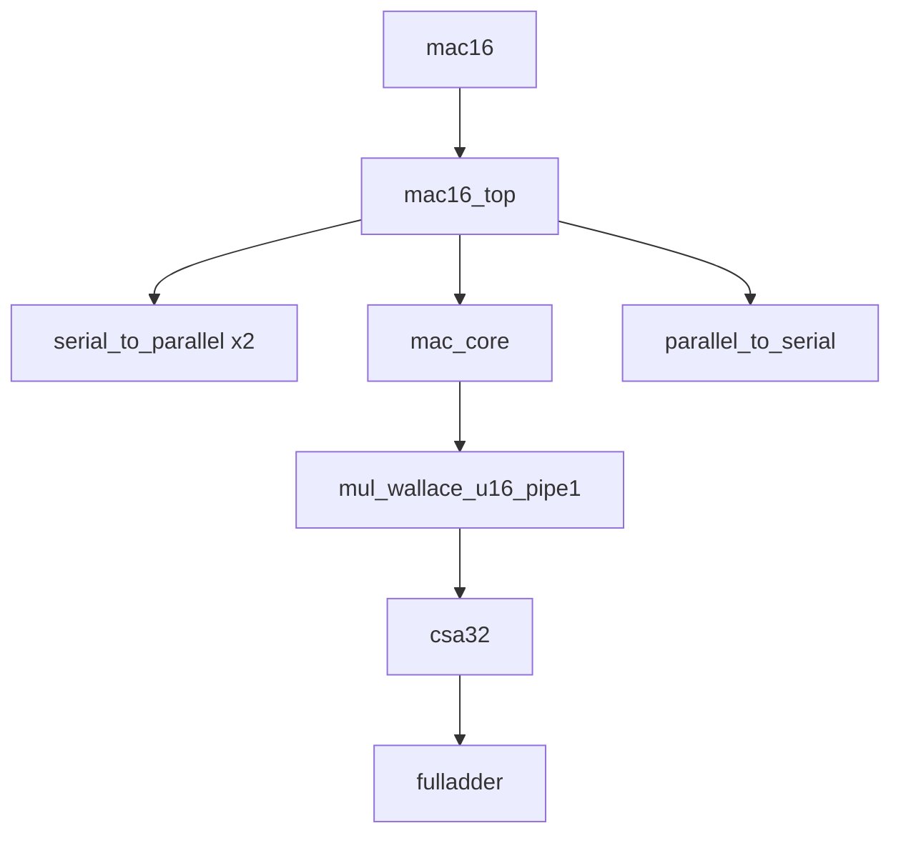
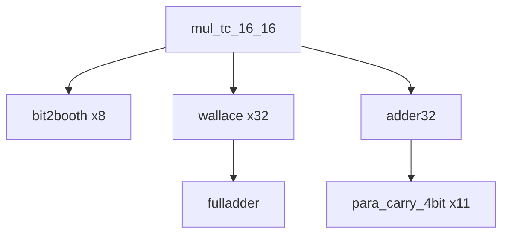
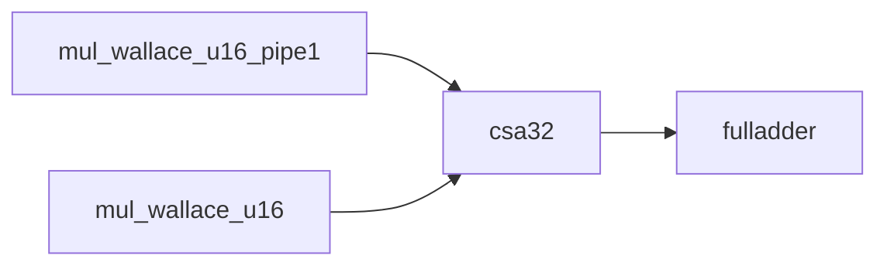

# IC_2026

语言标准说明：
- 本工程源码按 Verilog 语法编写，不使用 SystemVerilog 关键字与语法扩展。
- 工程验收编译口径采用 `iverilog -g2001`。
- 由于 Icarus Verilog 不提供独立 `-g2000` 开关（仅支持 `-g1995/-g2001/...`），
	本工程将 `-g2001` 作为 Verilog-2000 工程化验收口径。

审阅入口：
- [工程审阅导航](docs/review_guide.md)
- [赛题要求文本](3.22题目.md)
- [赛题提交验收说明](docs/contest_acceptance_report.md)

## 当前RTL层次架构与实例化关系

本工程在 rtl 目录下可以按"主线设计"和"并行独立乘法器支线"两部分理解。

### 1. 主线设计（赛题交付链路）

主线从 mac16 顶层封装进入，经过输入拼帧、调度、MAC运算、输出串化，形成完整数据通路。

说明：
- mac16 是赛题对外顶层封装，只暴露赛题定义的引脚。
- mac16_top 是系统控制和数据调度核心。
- serial_to_parallel 负责将 inA/inB 的 16bit 串行输入拼帧。
- mac_core 负责 mode 相关计算语义和 carry 粘滞逻辑。
- mul_wallace_u16_pipe1 是主线实际使用的 1 拍流水 Wallace 无符号乘法器。
- csa32 已拆分为公共模块，由乘法器复用。

### 2. 并行独立乘法器支线（非mac16主链路）

该支线是另一套乘法器实现，不参与当前 mac16 主路径实例化。

说明：
- mul_tc_16_16 是 Booth + Wallace + adder32 的结构化实现。
- 这条链路在工程内独立存在，通常用于独立验证或对照，不是当前 mac16 主数据通路。

### 3. csa32 公共化后的依赖关系

说明：
- csa32 已从 mul_wallace_u16 文件内抽离到 rtl/csa32.v。
- 目前 csa32 被 mul_wallace_u16_pipe1 和 mul_wallace_u16 共同依赖。

### 4. 关键文件与角色

- rtl/mac16.v: 赛题顶层封装。
- rtl/mac16_top.v: 系统级调度与流水控制。
- rtl/mac_core.v: MAC 计算语义与状态寄存器。
- rtl/mul_wallace_u16_pipe1.v: 主线乘法器（流水）。
- rtl/csa32.v: 公共 3:2 压缩器。
- rtl/mul_wallace_u16.v: 非流水 Wallace 乘法器实现。
- rtl/mul_tc_16_16.v: Booth-Wallace 乘法器实现。
- rtl/serial_to_parallel.v: 输入串并转换。
- rtl/parallel_to_serial.v: 输出并串转换。

